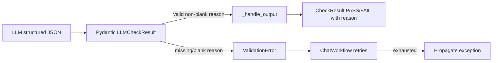

# Judge Required Reason - Plan

## Goal Capsule

- **Objective:** Make every `LLMCheckResult` carry a required, non-blank `reason` on pass and fail, and align built-in judge prompts so the model is always asked for a clear reason.
- **Product authority:** Product Contract below (from `ce-brainstorm`). Planning Contract and U-IDs own how.
- **Open blockers:** none.
- **Execution profile:** Small multi-package change (`giskard-checks` + aligned `giskard-llm` functional test). Prefer test-first for the schema unit.
- **Tail ownership:** Commit on the feature branch; keep PR draft until verification green. Do not change rich-console PASS display.

## Product Contract

### Summary

Judge structured output must always include a non-blank explanation for the verdict.
Built-in judge prompts must ask for that clear reason on every evaluation (pass and fail).

### Problem Frame

Today `reason` is optional on `LLMCheckResult`.
A pass can land with no explanation (or a generic fallback), so consumers cannot tell a justified pass from a vacuous one.
Some built-in prompts constrain how to reason about failures but never require a clear reason on every decision.

### Key Decisions

- **Require non-blank `reason` on the shared result model for both pass and fail** (session-settled: user-directed — chosen over pass-only flexibility: same model, same trust bar). Governs R1, R2.
- **Enforce via schema validation, not post-hoc rewriting of `CheckResult`** (session-settled: user-directed — chosen over optional reason + display/UI changes: reject incomplete judge output at parse time). Governs R1, R2.
- **Non-blank only** (session-settled: user-directed — chosen over min-length or ban on vague phrases like "ok": smallest change that makes vacuous passes untrustworthy). Governs R2.
- **Update built-in judge prompts to always request a clear reason** (session-settled: user-directed — added at confirmation). Governs R4.
- **Do not change rich-console pass display in this work** (session-settled: user-directed — chosen over "surface pass reasons" as primary pain). Governs Scope Boundaries.
- **Align giskard-llm judge-like functional test to the required non-blank contract without breaking provider coverage** (session-settled: user-directed — chosen over leaving optional-nullable wording). Governs R5.
- **No new CheckResult.error wrapping for blank reasons** (session-settled: user-directed — chosen over runner-side conversion: giskard-agents already retries on ValidationError). Governs R3.

### Requirements

**Schema**

- R1. `LLMCheckResult.reason` is required (not optional / not nullable).
- R2. Empty or whitespace-only `reason` values are invalid under the same schema validation as R1.

**Runtime behavior**

- R3. When structured output fails R1/R2, the check must not become a silent PASS; invalid output follows the existing giskard-agents structured-output validation path (retry on `ValidationError`, then propagate). Do not add new `CheckResult.error` wrapping for this case.

**Prompts**

- R4. Every built-in judge prompt template instructs the model to provide a clear `reason` for the evaluation decision on both pass and fail, without weakening existing pass/fail criteria.

**Docs / API surface**

- R5. Public docs, descriptions, and contract-aligned tests that still call judge `reason` optional are updated to match the required contract (including the giskard-llm judge-like functional schema).

### Acceptance Examples

- AE1. Covers R1, R2. **Given** judge structured output with `passed: true` and missing/`null`/`""`/`"   "` reason, **When** the output is validated, **Then** validation fails and the run does not record a trustworthy PASS with empty reason.
- AE2. Covers R1. **Given** judge structured output with `passed: false` and a non-blank reason, **When** the output is validated, **Then** validation succeeds and the failure carries that reason.
- AE3. Covers R4. **Given** each built-in judge prompt template, **When** inspected, **Then** it asks for a clear reason on the evaluation decision for both outcomes (pass and fail).
- AE4. Covers R3. **Given** repeated invalid blank reasons from the model under structured output, **When** retries are exhausted, **Then** the check outcome is not PASS (exception propagates via agents; no new default ERROR wrapping).

### Scope Boundaries

**In scope**

- `LLMCheckResult` required non-blank `reason`
- Built-in judge prompt templates under `libs/giskard-checks/src/giskard/checks/prompts/judges/`
- Tests and public wording that assume optional/`None` reason in giskard-checks
- Fallbacks that paper over missing reason once the field is always present
- giskard-llm functional test / `JudgeLikeResult` alignment to required non-blank `reason` (non-breaking to provider SDKs)

**Out of scope**

- Showing pass reasons in the rich console / report UI
- Rejecting low-quality or boilerplate wording beyond blank/whitespace
- Custom `Judge` prompts supplied by callers
- Custom `output_type` models that do not use `LLMCheckResult`
- Changing scenario/testing runners to wrap `ValidationError` into `CheckResult.error` by default
- giskard-llm translator unit tests that only use optional `reason` as a non-strict json_schema example (unless wording falsely claims checks alignment)

### Dependencies / Assumptions

- Assumption: `ChatWorkflow` retries on pydantic `ValidationError` for structured output (`libs/giskard-agents/src/giskard/agents/workflow.py`); this work relies on that path.
- Assumption: user-authored `Judge` prompts remain the caller's responsibility; schema validation still rejects blank reasons even if their prompt forgets to ask.

### Sources / Research

- Current optional field and pass/fail mapping: `libs/giskard-checks/src/giskard/checks/judges/base.py`
- Built-in prompts: `libs/giskard-checks/src/giskard/checks/prompts/judges/` (`conformity`, `toxicity`, `answer_relevance`, `groundedness`, `contradiction`)
- Structured-output validation retries: `libs/giskard-agents/src/giskard/agents/workflow.py`
- Non-blank Field precedent: `libs/giskard-checks/src/giskard/checks/generators/user.py` (`min_length=1`); scan sibling uses `Field(..., min_length=1)` without strip — R2 still needs strip-then-non-empty
- Console currently blanks PASS messages: `libs/giskard-checks/src/giskard/checks/core/result.py` (deliberately unchanged here)
- Coupled llm test: `libs/giskard-llm/tests/functional/test_completion.py` (`JudgeLikeResult`, `test_response_format_optional_nullable_reason`)

## Planning Contract

### Key Technical Decisions

- KTD1. **Strip whitespace before non-empty validation on `reason`.** Prefer a before-validator (or equivalent) that strips, then reject empty — `min_length=1` alone accepts `"   "`. (session-settled: user-approved — instantiates R2). Cites R2.
- KTD2. **Leave exception-to-CheckResult mapping unchanged.** Blank/missing reasons surface as agents `ValidationError` → retry → propagate; do not add wrapping in `BaseLLMCheck` or runners for this feature. (session-settled: user-directed — chosen over CheckResult.error wrapping). Cites R3.
- KTD3. **Remove `"Check passed"` / `"Check failed"` fallbacks once `reason` is always present.** Use the validated reason as `message` directly. Cites R1.
- KTD4. **Update giskard-llm `JudgeLikeResult` to required non-blank `reason` and rename/adjust the functional test accordingly.** Keep assertions structural (parseable, non-empty reason) so provider coverage stays non-breaking. (session-settled: user-directed). Cites R5.
- KTD5. **Primary prompt gaps are `groundedness.j2` and `contradiction.j2`.** Other built-ins already ask for a reason; tighten wording only if needed for R4 consistency without changing pass/fail criteria. Cites R4.

### High-Level Technical Design

### Implementation Constraints

- Follow existing Pydantic v2 patterns in giskard-checks; no `# type: ignore` for this change.
- Do not reformat untouched files.
- Conventional Commits for commits under this work.

### Sequencing

1. U1 schema + schema-focused unit tests (breaks mocks that send `null` reason).
2. U2 prompts (can parallel with U3 after U1 lands locally).
3. U3 migrate giskard-checks mocks/tests.
4. U4 align giskard-llm functional test (unit CI unchanged; functional needs keys when run).

## Implementation Units

### U1. Require non-blank `LLMCheckResult.reason`

- **Goal:** Make `reason` required and reject blank/whitespace via Pydantic validation; stop papering over missing reasons in `_handle_output`.
- **Requirements:** R1, R2, R3, R5 (local docstring/Field description)
- **Dependencies:** none
- **Files:**
  - `libs/giskard-checks/src/giskard/checks/judges/base.py`
  - `libs/giskard-checks/src/giskard/checks/judges/judge.py` (docstring: reason no longer optional)
  - `libs/giskard-checks/tests/builtin/test_llm_check_result.py` (create) or extend `tests/builtin/test_judge.py` / `test_base.py`
- **Approach:**
  1. Change `LLMCheckResult.reason` to required `str` with strip + non-empty validation (KTD1).
  2. Update Field description away from "Optional explanation".
  3. In `_handle_output`, pass `output_value.reason` through without `or "Check passed/failed"` (KTD3).
  4. Update `judge.py` docstring so it no longer calls `reason` optional.
  5. Add direct `LLMCheckResult.model_validate` unit tests for AE1/AE2 shapes (missing, null, `""`, whitespace, valid).
- **Execution note:** Start with failing schema unit tests for blank/missing reason, then implement validation.
- **Patterns to follow:** `Field(..., min_length=1)` in `generators/user.py`; prefer strip before empty check so whitespace fails (R2).
- **Test scenarios:**
  - Covers AE1. Missing `reason` key → `ValidationError`
  - Covers AE1. `reason: null` → `ValidationError`
  - Covers AE1. `reason: ""` → `ValidationError`
  - Covers AE1. `reason: "   "` → `ValidationError`
  - Covers AE2. `passed: false` with non-blank reason → validates; fields preserved
  - `passed: true` with non-blank reason → validates
- **Verification:** Schema unit tests fail for blank/missing and pass for non-blank; `_handle_output` no longer substitutes generic messages.

### U2. Align built-in judge prompts

- **Goal:** Every shipped judge `.j2` asks for a clear `reason` on both pass and fail without changing evaluation criteria.
- **Requirements:** R4, AE3
- **Dependencies:** none (can land with or after U1)
- **Files:**
  - `libs/giskard-checks/src/giskard/checks/prompts/judges/groundedness.j2`
  - `libs/giskard-checks/src/giskard/checks/prompts/judges/contradiction.j2`
  - `libs/giskard-checks/src/giskard/checks/prompts/judges/conformity.j2` (review only; already asks)
  - `libs/giskard-checks/src/giskard/checks/prompts/judges/toxicity.j2` (review only)
  - `libs/giskard-checks/src/giskard/checks/prompts/judges/answer_relevance.j2` (review only)
- **Approach:**
  1. Add an explicit instruction to provide a clear reason for the evaluation decision on both pass and fail in groundedness and contradiction (KTD5).
  2. Keep existing constraints (e.g. do not cite omissions as failure reasons).
  3. Spot-check other three templates; only edit if they lack a clear always-on reason ask.
- **Test scenarios:**
  - Covers AE3. Static assertion or review checklist: each of the five templates contains an instruction to provide a clear reason for pass and fail (implementer may use a small unit test scanning template text, or document review in PR if no existing prompt-test harness)
- **Verification:** All five templates satisfy R4; groundedness/contradiction no longer only constrain failure reasoning.

### U3. Migrate giskard-checks mocks and judge tests

- **Goal:** Tests and mocks produce required non-blank reasons; former `reason=None` cases become validation-failure expectations where they exercised optional reason.
- **Requirements:** R1, R2, R3, AE1, AE4
- **Dependencies:** U1
- **Files:**
  - `libs/giskard-checks/tests/testing_utils.py` (`MockJudgeGenerator.reason`)
  - `libs/giskard-checks/tests/builtin/test_judge.py` (local MockGenerator + None-reason tests)
  - `libs/giskard-checks/tests/builtin/test_conformity.py`
  - `libs/giskard-checks/tests/builtin/test_toxicity.py`
  - `libs/giskard-checks/tests/builtin/test_groundedness.py`
  - `libs/giskard-checks/tests/builtin/test_contradiction.py`
  - `libs/giskard-checks/tests/builtin/test_answer_relevance.py`
- **Approach:**
  1. Change mock `reason` type to `str` (required); stop dumping JSON `null`.
  2. Replace convenience `reason=None` fixtures with non-blank placeholder reasons where the test is not about missing reason.
  3. For tests specifically about None reason (`test_none_reason_is_handled`, etc.), convert to expect validation failure / non-PASS per R3/KTD2 (exception or failed parse after retries — mirror existing workflow validation test patterns; do not introduce new ERROR wrapping).
- **Test scenarios:**
  - Happy-path judge runs still PASS/FAIL with `details["reason"]` equal to the mock reason
  - Covers AE1/AE4. Attempting null/blank reason through the mock/workflow path does not yield PASS
  - Existing behavioral tests for each built-in judge still cover their criteria with non-blank reasons
- **Verification:** `make test-unit PACKAGE=giskard-checks` green.

### U4. Align giskard-llm judge-like functional test

- **Goal:** Stop claiming optional-nullable `reason` matches LLM checks; keep provider functional coverage non-breaking.
- **Requirements:** R5
- **Dependencies:** U1 (contract truth); can land in same PR after U1
- **Files:**
  - `libs/giskard-llm/tests/functional/test_completion.py` (`JudgeLikeResult`, `test_response_format_optional_nullable_reason`)
- **Approach:**
  1. Update `JudgeLikeResult.reason` to required non-blank (same strip/non-empty bar as U1, or at least required `str` with `min_length=1` + strip if mirroring).
  2. Rename test away from `optional_nullable_reason`; prompt the model to always include a clear reason.
  3. Assert structure only: validated model, non-empty stripped reason — never assert specific wording (giskard-llm testing rules).
- **Test scenarios:**
  - Structured completion with judge-like schema returns JSON that validates as required non-blank `reason`
  - Test remains parametrized across providers without depending on reason text content
- **Verification:** Functional test file updated; unit CI unaffected. When keys available, `make test-functional PACKAGE=giskard-llm` for that scenario does not fail due to schema mismatch with checks.

## Verification Contract

- `make format`
- `make check`
- `make test-unit PACKAGE=giskard-checks`
- If U4 changes run in CI unit jobs: ensure no unit-marked regressions in `giskard-llm`
- Optional when keys present: functional judge-like scenario under `giskard-llm`
- Do not weaken assertions to force green; fix root cause

## Definition of Done

- R1–R5 and AE1–AE4 satisfied
- U1–U4 complete with listed test scenarios
- No rich-console PASS display changes
- No new default `CheckResult.error` wrapping for blank reasons
- Abandoned experiment code removed from the diff
- `make format && make check && make test-unit PACKAGE=giskard-checks` pass
